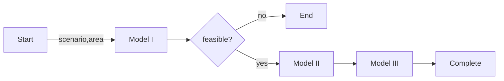

# Kramdown

Only two markdown processors are supported by GitHub pages with jekyll, here we follow the kramdown syntax to create our markdown files. In this note, a few essential contents for creating document will be listed for reference.

## Inline formatting

<table>
  <tbody>
    <tr>
      <td><em>Italics</em></td>
      <td>
<code class="language-plaintext highlighter-rouge">*Italics*</code> or <code class="language-plaintext highlighter-rouge">_Italics_</code>
</td>
    </tr>
    <tr>
      <td><strong>Bold</strong></td>
      <td>
<code class="language-plaintext highlighter-rouge">**Bold**</code> or <code class="language-plaintext highlighter-rouge">__Bold__</code>
</td>
    </tr>
    <tr>
      <td><code class="language-plaintext highlighter-rouge">Inline code</code></td>
      <td><code>`Inline code`</code></td>
    </tr>
    <tr>
      <td><code>Inline code</code></td>
      <td><code class="language-plaintext highlighter-rouge">&lt;code&gt;Inline code&lt;/code&gt;</code></td>
    </tr>
    <tr>
      <td>*Escaping*</td>
      <td><code class="language-plaintext highlighter-rouge">\*Escaping\*</code></td>
    </tr>
    <tr>
      <td><del>Strikethrough</del></td>
      <td><code class="language-plaintext highlighter-rouge">&lt;del&gt;Strikethrough&lt;/del&gt;</code></td>
    </tr>
    <tr>
      <td>– (en-dash)</td>
      <td><code class="language-plaintext highlighter-rouge">--</code></td>
    </tr>
    <tr>
      <td>— (em-dash)</td>
      <td><code class="language-plaintext highlighter-rouge">---</code></td>
    </tr>
    <tr>
      <td>… (ellipsis)</td>
      <td><code class="language-plaintext highlighter-rouge">...</code></td>
    </tr>
    <tr>
      <td>«guillemet»</td>
      <td>
<code class="language-plaintext highlighter-rouge">&lt;&lt;</code> and <code class="language-plaintext highlighter-rouge">&gt;&gt;</code>
</td>
    </tr>
    <tr>
      <td>
  (emojis)</td>
      <td><code class="language-plaintext highlighter-rouge">:lollipop: :+1:</code></td>
    </tr>
    <tr>
    <td><kbd>ESC</kbd></td>
    <td>&lt;kbd&gt;ESC&lt;/kbd&gt; (this is pure html)</td>
    </tr>
  </tbody>
</table>

Generally, markdown doesn't support text color. The most common workaround is using html.

```html
Here you go: <font color='red'>Text in red</font> 
```

Here you go: <font color='red'>Text in red</font> 


Another way is using $\LaTeX$ syntax, for example


```latex
Here you go: $\color{red}{\text{Text in red}}$
```

Here you go: $\color{red}{\text{Text in red}}$

>⚠️: this doesn't work for Kramdown \text{\color{red}Text in red}


## Paragraph formatting and sectioning
<table>
  <tbody>
    <tr>
      <td>Level 1 header</td>
      <td><code class="language-plaintext highlighter-rouge"># header {#id}</code></td>
    </tr>
    <tr>
      <td> </td>
      <td>
<code class="language-plaintext highlighter-rouge">header</code> with = underline</td>
    </tr>
    <tr>
      <td>Level 2 header</td>
      <td><code class="language-plaintext highlighter-rouge">## header {#id}</code></td>
    </tr>
    <tr>
      <td> </td>
      <td>
<code class="language-plaintext highlighter-rouge">header</code> with - underline</td>
    </tr>
    <tr>
      <td>Level 3 header</td>
      <td><code class="language-plaintext highlighter-rouge">### header {#id}</code></td>
    </tr>
    <tr>
      <td>Level 4 header</td>
      <td><code class="language-plaintext highlighter-rouge">#### header {#id}</code></td>
    </tr>
    <tr>
      <td>Block quote</td>
      <td><code class="language-plaintext highlighter-rouge">&gt; this is a quote</code></td>
    </tr>
    <tr>
      <td>Line break</td>
      <td><code class="language-plaintext highlighter-rouge">This is a\\</code></td>
    </tr>
    <tr>
      <td> </td>
      <td><code class="language-plaintext highlighter-rouge">line break</code></td>
    </tr>
    <tr>
      <td>Horizontal rule</td>
      <td>
<code class="language-plaintext highlighter-rouge">* * *</code> or <code class="language-plaintext highlighter-rouge">---</code>
</td>
    </tr>
    <tr>
      <td>Code paragraph</td>
      <td>Start with four blank indentation.</td>
    </tr>
    <tr>
      <td> </td>
      <td>Delimit with <code class="language-plaintext highlighter-rouge">~~~</code> or <code>```</code>
</td>
    </tr>
    <tr>
      <td> </td>
      <td>Delimit with <code class="language-plaintext highlighter-rouge">~~~language</code> or <code>```language</code> for color syntax</td>
    </tr>
    <tr>
      <td>Unordered list</td>
      <td>Items with <code class="language-plaintext highlighter-rouge">*</code> or <code class="language-plaintext highlighter-rouge">-</code> or <code class="language-plaintext highlighter-rouge">+</code>
</td>
    </tr>
    <tr>
      <td>Ordered list</td>
      <td>Number and a dot</td>
    </tr>
    <tr>
      <td>Definition list</td>
      <td>Normal paragraph followed by <code class="language-plaintext highlighter-rouge">:</code> and space</td>
    </tr>
    <tr>
      <td>HTML</td>
      <td>HTML blocks are accepted</td>
    </tr>
    <tr>
      <td>Footnotes</td>
      <td>
<code class="language-plaintext highlighter-rouge">[^label]</code> and <code class="language-plaintext highlighter-rouge">[^label]: text</code> at the end</td>
    </tr>
    <tr>
      <td>Abbreviations</td>
      <td>
<code class="language-plaintext highlighter-rouge">*[label]: description</code> at the end</td>
    </tr>
    <tr>
      <td>Task lists</td>
      <td>
<code class="language-plaintext highlighter-rouge">- [ ] Incomplete</code> <code class="language-plaintext highlighter-rouge">- [x] Complete</code>
</td>
    </tr>
  </tbody>
</table>

## Link

```
Visit [kramdown](https://kramdown.gettalong.org/index.html) for more details in its syntax
```
Visit [kramdown](https://kramdown.gettalong.org/index.html) for more details in its syntax

[kramdown][k1] is a Ruby solution of pages generator
Reference:
[k1]: https://kramdown.gettalong.org/index.html

Images
```
{:height="100px" width="100px"}
```
{:height="100px" width="100px"}

## Code block

This could be used to demonstrate the source code, for example, Python or bash
  ```
    ```python
    import numpy as np

    arr = np.linspace(1, 10, num = 100)
    print(arr)
    ```
  ```

  ```python
  import numpy as np

  arr = np.linspace(1, 10, num = 100)
  print(arr)
  ```

  ```
    ```bash
    $ sudo add-apt-repository ppa:deadsnakes/ppa
    $ sudo apt update
    $ apt list | grep python3.11
    ```
  ```

  ```bash
  $ sudo add-apt-repository ppa:deadsnakes/ppa
  $ sudo apt update
  $ apt list | grep python3.11
  ```

There are also the other features supported by similar way, such like mermaid:

  ```
    ```mermaid
    flowchart  LR;
    Start-->|scenario,area| M1[Model I] 
    M1-->F1{feasible?}
    F1-->|no| End
    F1-->|yes| M2[Model II]
    M2-->M3[Model III]
    M3-->Complete
    ```
  ```




## Table

Demonstration of markdown table  
 
```
|-------------+-----+-----+-----+-----+-----+-----+-----+-----+-----+-----+-----+-----|
| time_bucket |  -3 |  -2 |  -1 |  0  |  1  |  2  |  3  |  4  |  5  |  6  |  7  |  8  |
|------------:|:---:|:---:|:---:|:---:|:---:|:---:|:---:|:---:|:---:|:---:|:---:|:---:|
|   wafer_out | N/A | N/A | N/A | 100 | 100 | 100 | 150 | 150 | 200 | 200 | 200 | 200 |
|        MTTS |  3  |  3  |  3  |  3  |  3  |  3  |  3  |  3  |  3  |  3  |  3  |  3  |
| wafer_start | 100 | 100 | 100 | 150 | 150 | 200 | 200 | 200 | 200 | N/A | N/A | N/A |
```
| time_bucket |  -3 |  -2 |  -1 |  0  |  1  |  2  |  3  |  4  |  5  |  6  |  7  |  8  |
|------------:|:---:|:---:|:---:|:---:|:---:|:---:|:---:|:---:|:---:|:---:|:---:|:---:|
|   wafer_out | N/A | N/A | N/A | 100 | 100 | 100 | 150 | 150 | 200 | 200 | 200 | 200 |
|        MTTS |  3  |  3  |  3  |  3  |  3  |  3  |  3  |  3  |  3  |  3  |  3  |  3  |
| wafer_start | 100 | 100 | 100 | 150 | 150 | 200 | 200 | 200 | 200 | N/A | N/A | N/A |


## Math

### in-line mode

```
Assume line yield rate $\gamma$ is given
```
Assume line yield rate $\gamma$ is given


### display mode

```
The total amount $y$ will be
$$
\sum^n_{i=1} x_i
$$
```

The total amount $y$ will be
$$
\sum^n_{i=1} x_i
$$

## Plaintext code block
`plaintext` won't really disable all syntax highlight for your code block.  
Basically, we apply code block with `nohighlight` to wrap docstrings for package/module document  

````
>### package.module.class.method()
```nohighlight 
        Args:
            path (str): path to the target file
            cache_mode (bool, optional): allows cache or not(default True)
        Return:
            Dict                                
```
````

>### package.module.class.method()
```nohighlight 
        Args:
            path (str): path to the target file
            cache_mode (bool, optional): allows cache or not(default True)
        Return:
            Dict                                
```

## Collapsible Code Blocks
~~~
{::options parse_block_html="true" /}

<details><summary markdown="span">Let's see some code!</summary>
```python
print('Hello World!')
```
Of course, it has to be Hello World, right?
</details>
<br/>

{::options parse_block_html="false" /}
~~~

{::options parse_block_html="true" /}

<details><summary markdown="span">Let's see some code!</summary>
```python
print('Hello World!')
```
Of course, it has to be Hello World, right?
</details>
<br/>

{::options parse_block_html="false" /}

## Include a set of backticks within a code block

Here is how you create the markdown tutorials which points out the usage of code blocks :-)

`````
````
```python
import logging
import json
```
````
`````